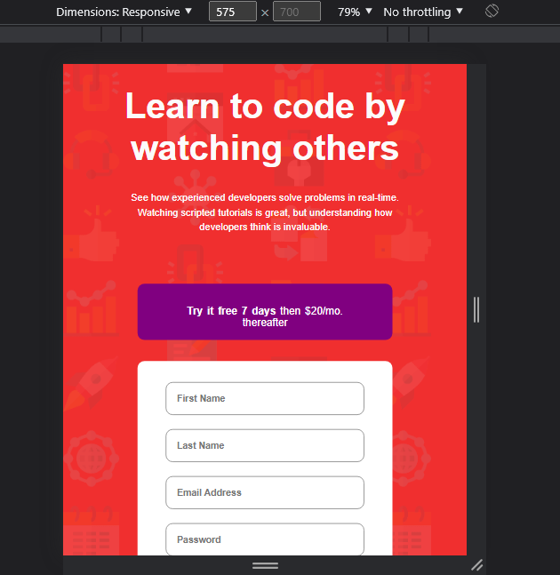

## Table of contents

- [Overview](#overview)
  - [The challenge](#the-challenge)
  - [Screenshot](#screenshot)
  - [Links](#links)
- [My process](#my-process)
  - [Built with](#built-with)
  - [What I learned](#what-i-learned)
  - [Continued development](#continued-development)
  - [Useful resources](#useful-resources)
- [Author](#author)
- [Acknowledgments](#acknowledgments)

## Overview
This is a solution to the [Intro component with sign up form challenge on Frontend Mentor](https://www.frontendmentor.io/challenges/intro-component-with-signup-form-5cf91bd49edda32581d28fd1).

### The challenge

Users should be able to:

- View the optimal layout for the site depending on their device's screen size
- See hover states for all interactive elements on the page
- Receive an error message when the `form` is submitted if:
  - Any `input` field is empty. The message for this error should say *"[Field Name] cannot be empty"*
  - The email address is not formatted correctly (i.e. a correct email address should have this structure: `name@host.tld`). The message for this error should say *"Looks like this is not an email"*

### Screenshot





### Links

- Solution URL: [Add solution URL here](https://your-solution-url.com)
- Live Site URL: [Add live site URL here](https://iceberg61.github.io/Intro-component-with-sign-up-form/)

### Built with

- Semantic HTML5 markup
- CSS custom properties
- Flexbox

### What I learned


I learnt how to do form validation in js. it was quite interesting and i would love to do more of it 
Here is a code snippets of email validation.
```js
email.addEventListener('input', validateEmail) 
function validateEmail() {
    if (!email.value.match(patterns)) {
        const emailError = document.getElementById('email-error');
        emailError.innerHTML = "Looks like this is not an email";
        iconError.src = '../images/icon-error.svg'
        email.classList.add('error');
    }
}
```

## Author

- Website - [Add your name here](https://www.your-site.com)
- Frontend Mentor - [@iceberg61](https://www.frontendmentor.io/profile/iceberg61)
- Twitter - [@ayanakoji-kiyo](https://www.twitter.com/ayanakoji-kiyo)
